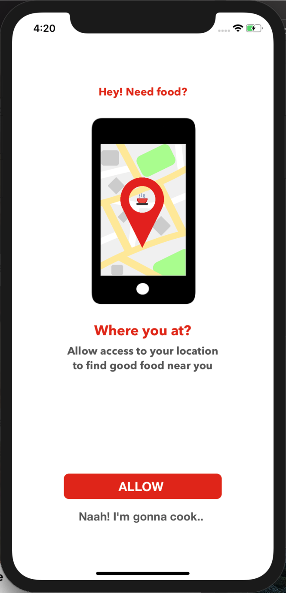

# Where's the Food?
App that displays nearest restaurants using [Yelp APIs](https://www.yelp.com/developers)

## Working of the app
* Allow access to your current location
* View restaurants near you
* Restaurants are sorted by distance
* Rating and distance to the restaurant can be seen instantly
* See detailed view by clicking one of the restaurants

## Built with
* [Yelp APIs](https://www.yelp.com/developers) (3.0.0)
* [AlamofireImage](https://github.com/Alamofire/AlamofireImage) (3.5.2)
* [Moya](https://github.com/Moya/Moya) (13.0.1)
* CoreLocation
* Reverse Geocoding

## Some screenshots and GIFs

Main Screen                               |  Nearest Restaurants Lists                 
:----------------------------------------:|:---------------------------------------------:
  |    

This app is inspired by [Gary Tokman](https://github.com/gtokman/Restaurant-Viewing-App)
